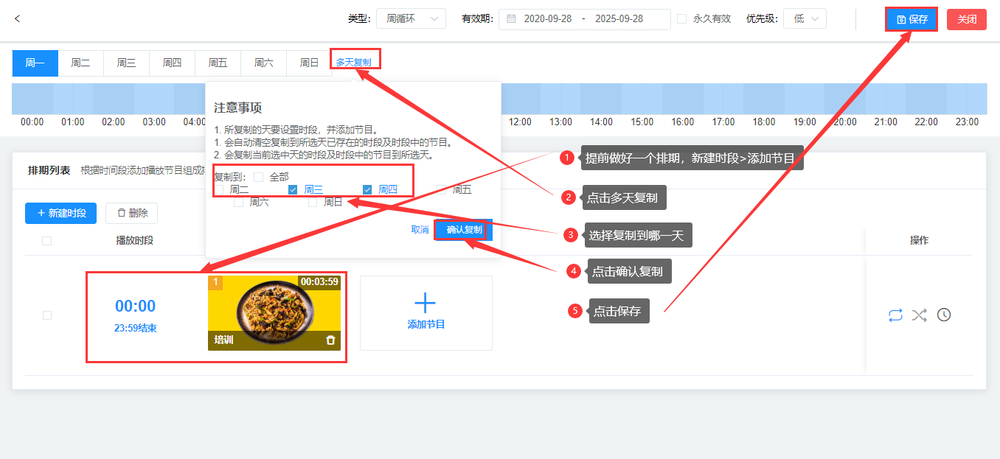

### 排期优先级
当两个排期在同一个时间发布在同一屏幕时, 系统会先以排期类型确定优先级（规则如下）。

1、系统会先以排期类型确定优先级，按照指定日期，播放类型等级最高的排期节目；   
2、在排期类型相同时，以排期设定的优先级高>中>低，播放优先级最高的排期节目；   
3、当优先级相同时，以后发布>前发布，播放发布时间最新的排期节目。

### 排期有效时间
从设置的那天到结束的某一天都是有效播放的                
（注：日循环和周循环是一样的，指定日期只有一天哦，记得保存~）。

### 永久性有效排期
系统默认的是1900-1-1至2050-设置那天日期，有的机器会丢失时间，导致节目不能播放，所以设置一个长时间。

### 多天复制
首先需要新建一个时段和节目添加好之后，会复制当前选中天的时段及时段中的节目到所天。

①新建时段—添加节目—节目列表—选中节目—确定   
②多天复制  
③复制到所选天  
④确认复制      
⑤保存

注意事项：
1. 所复制的天要设置时段，并添加节目。
2. 会自动清空复制到所选天已存在的时段及时段中的节目。
3. 会复制当前选中天的时段及时段中的节目到所选天。
