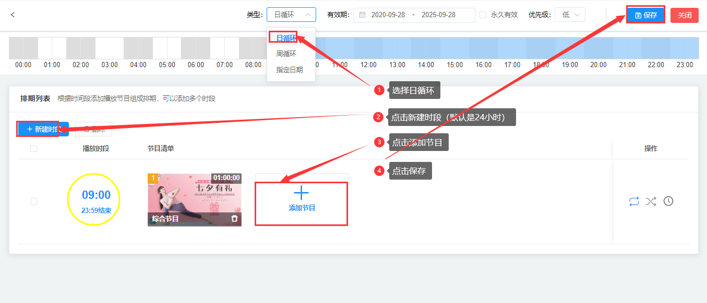
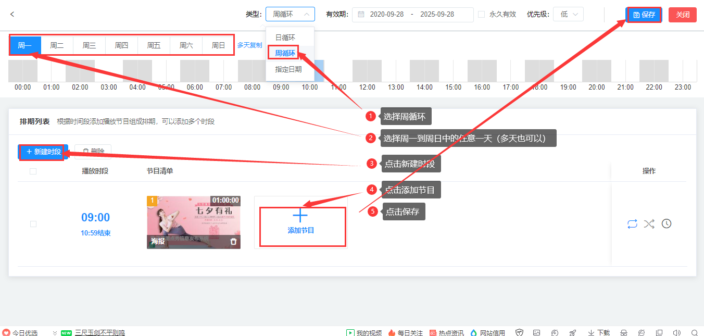
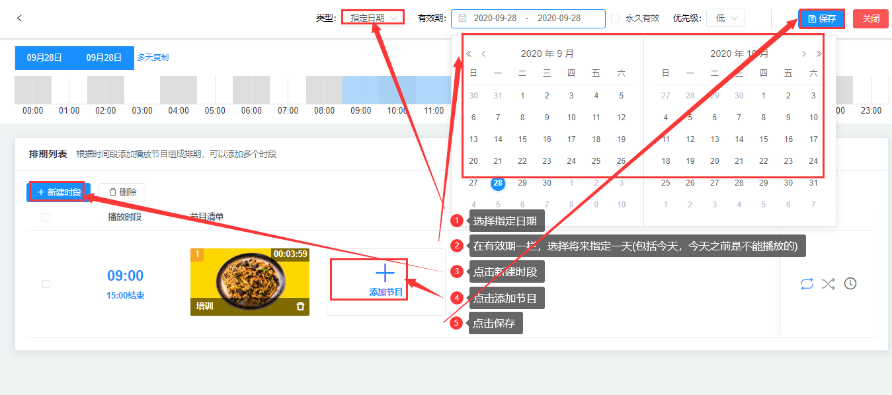
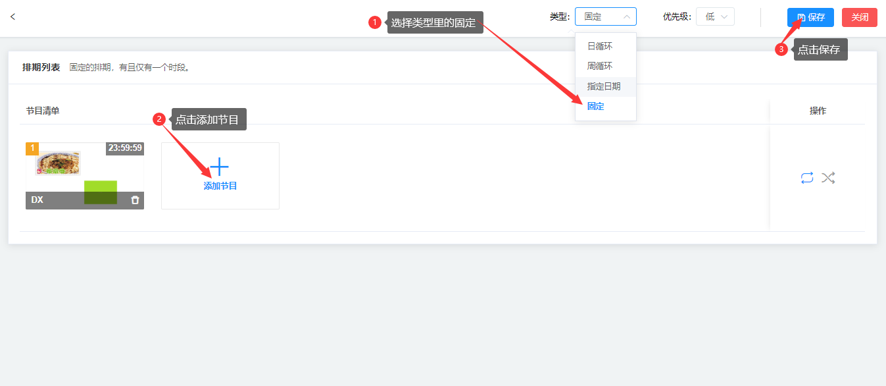

### 日排期
按日进行循环播放的排期

（1）选择（类型）日循环，点击新建时段，点击添加节目，点击保存          

### 周排期
按周进行循环播放的排期，可指定周一到周日的播放内容。

（1）选择（类型）周循环，选择周一到周日中的任一一天（注：多天也可以），点击新建时段，点击添加节目，点击保存。   
（注：根据时间段添加播放节目组成排期，可以添加多个时段）          

### 指定日期
指定将来某1-N天的排期。如设置国庆档、春节档。                  
（注：除去今天以前，包括今天）

（1）选择（类型）指定日期，（有效期）选择将来指定一天（注:包括今天，今天之前是不能播放的），点击新建时段，点击添加节目>节目列表>选中节目>确定，点击保存。

### 固定排期
固定的排期，有且只有一个时段，排期里的节目无限循坏播放      
（1）点击类型选项里的固定，然后点击添加节目，最后点击保存。

