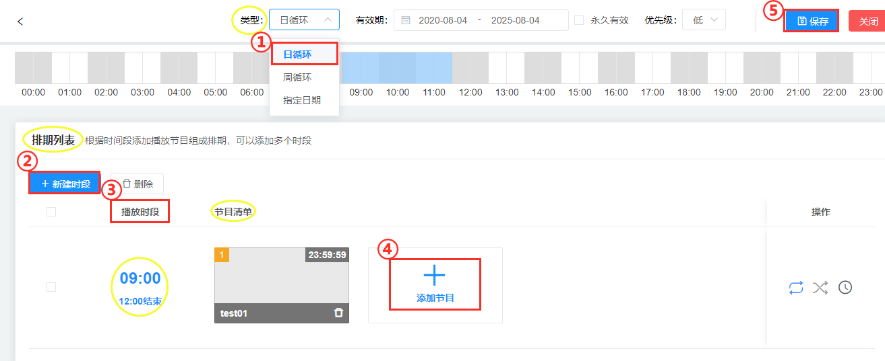
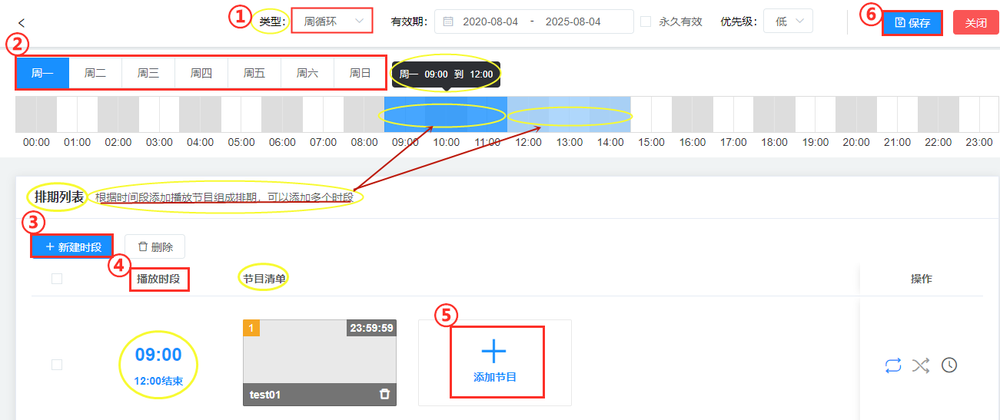
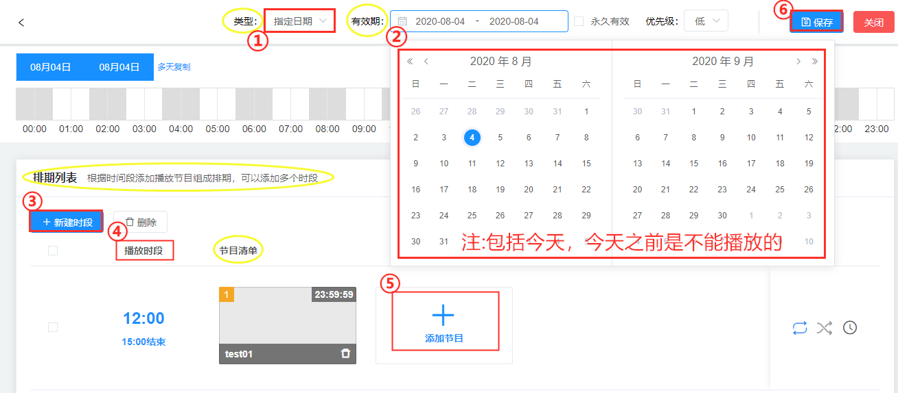

## 排期周期设置
### 日排期
按日进行循环播放的排期

①（类型）日循环                                                
②（排期列表）新建时段     
③选择播放时间段（注：默认是24小时）   
④添加节目     
⑤保存          

### 周排期
按周进行循环播放的排期，可指定周一到周日的播放内容。

①（类型）周循环   
②选择周一到周日中的任一一天(注：多天也可以)     
③新建时段     
④选择播放时间段      
⑤添加节目   
⑥保存   
（注：根据时间段添加播放节目组成排期，可以添加多个时段）          

### 指定日期
指定将来某1-N天的排期。如设置国庆档、春节档。                  
（注：除去今天以前，包括今天）

①（类型）指定日期              
②（有效期）选择将来指定一天（注:包括今天，今天之前是不能播放的）
③新建时段       
④选择播放时段       
⑤添加节目—节目列表—选中节目—确定    
⑥保存

