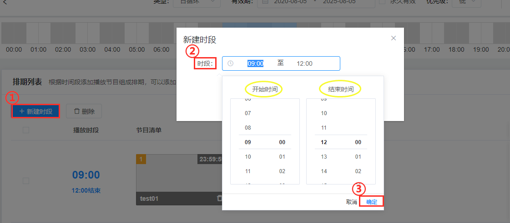
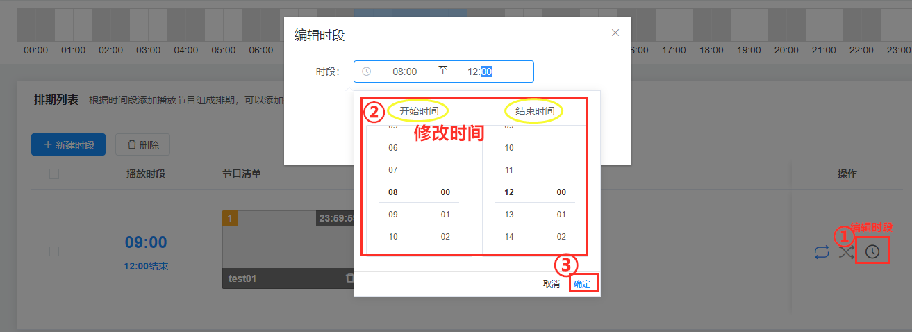
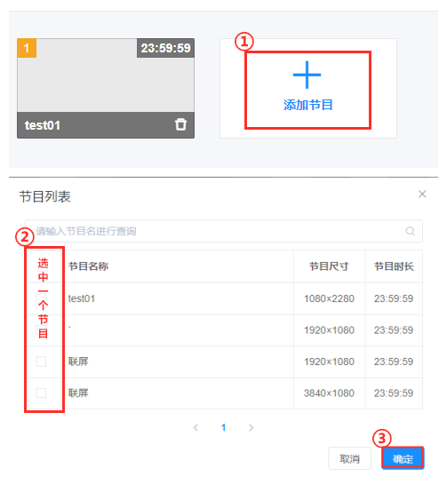
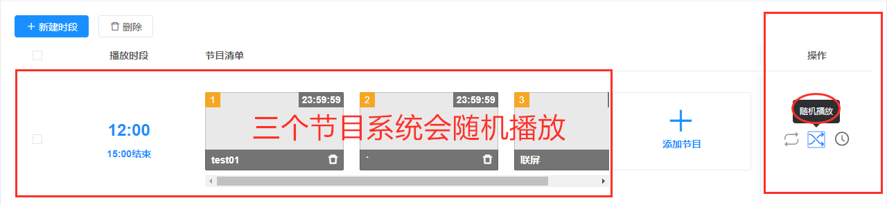
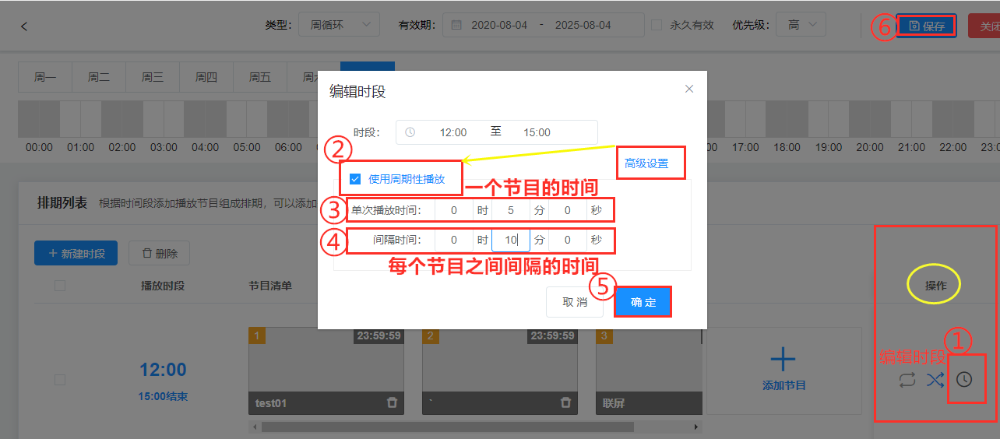

### 建立时段
①新建时段   
②编辑时段（选择开始和结束时间）      
③确定

### 修改时段
①编辑时段     
②修改时间      
③确定

### 添加节目

①添加节目   
②选中节目    
③确定

### 节目顺序播放
指定时间段内，多个节目，按顺序播放，播放顺序可以任意拖动节目进行调整。

### 随机播放
指定时间段内，多个节目，不按一定的顺序播放，是系统随机播放。

### 周期性播放
在选中的时间段内，多个节目按照你设置的单次播放时间和间隔时间，呈现周期性播放。

①（操作）编辑时段         
②（高级设置）使用周期性播放           
③单次播放时间（注：一个节目的时间）   
④间隔时间（注：每个节目之间间隔的时间）   
⑤确定     
⑥保存

