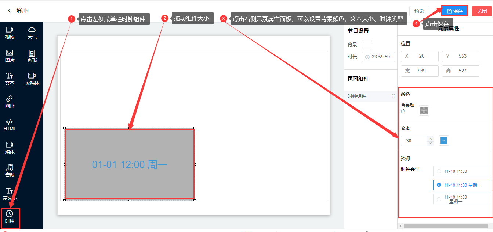
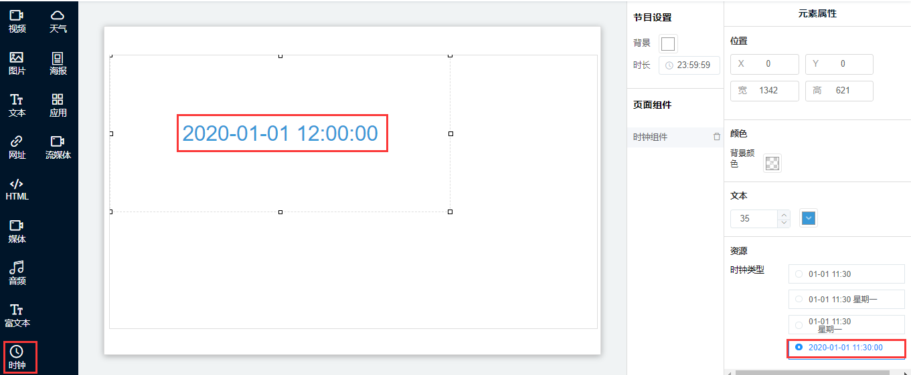

## 时钟组件

* 时钟组件是用于展示时间的框体控件。
* 点击左侧菜单栏里时钟组件，组件大小可以随意拖动，或者在右侧元素属性菜单栏里可以设置组件的大小，背景颜色、文本的大小、资源一栏里可以设置时钟类型，点击保存。

#### 功能说明：

* 组件的时间展示的是屏幕设备本身的时间。

* 在节目的播放中，时钟组件会自行更新时间。

* 时钟支持类型、背景色、字体等设置。

* 时钟组件新加一个，可以显示到秒。

