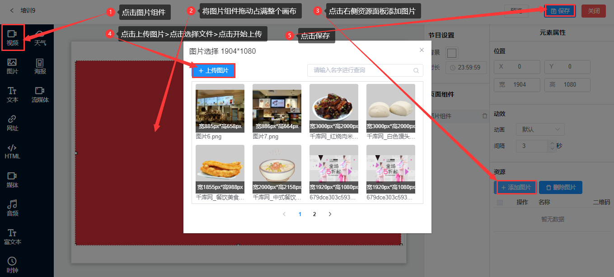

## 图片组件

*  图片组件是用于滚动播放图片资源的框体控件，可设置最少一个图片资源。
*  点击左侧菜单栏的图片组件，图片组件可以随意拖动大小，点击右侧资源菜单下的添加图片，弹出图片选择页面，点击上传图片>选择文件>开始上传>点击保存。

* 屏幕显示（针对异形屏幕）

1. 居中：长边自适应，窄边可能有黑边（如果比例不对的情况）支持所有组件。

2. 拉伸：拉伸到整个屏幕，可能变形。支持（图片、视频、媒体、流媒体）。主要用于异形屏。

* 动效设置

1. 动画：不点击就是默认没有动效的，有手风琴、深入浅出、深出浅入等多种特效，可以根据需要自行选择。

2. 间隔：默认是3秒，可以自己调整，最短间隔是1秒。

* 资源上传/删除

1.  添加图片：可以添加多张图片，图片组件逐个顺序播放所有图片资源，通过上移/下移调整播放顺序。

2.  删除图片：首先选中图片，再点击删除图片。
