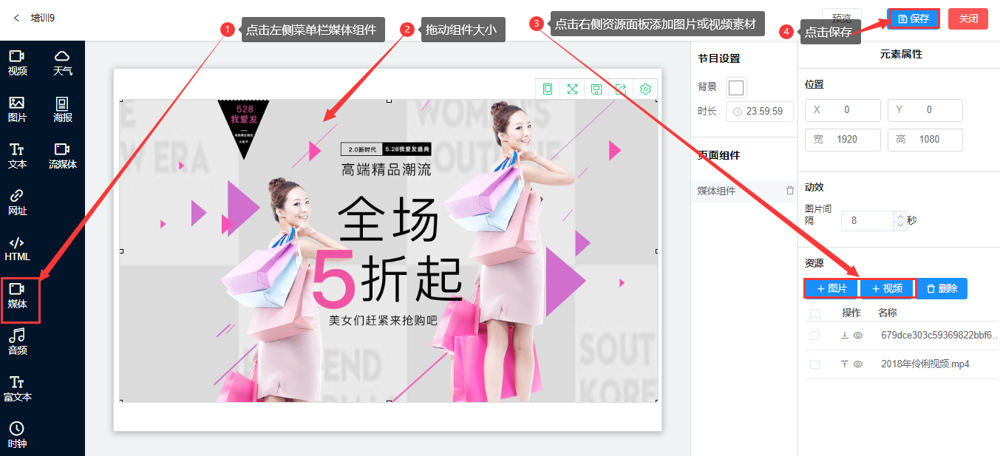

## 媒体组件
* 媒体组件是用于播放图片和视频的组合框体控件。
* 点击左侧菜单栏的媒体组件，拖动组件大小，在右侧资源面板中添加图片或视频素材，点击保存。

* 屏幕显示（针对异形屏幕）

1.  居中：长边自适应，窄边可能有黑边（如果比例不对的情况）支持所有组件。

2.  拉伸：拉伸到整个屏幕，可能变形。支持（图片、视频、媒体、流媒体）。主要用于异形屏。

* 动效设置

1.  间隔时间：默认是8秒，可以自己调整，最短间隔是1秒。

* 资源上传/删除

1. 添加图片：可以添加多张图片，图片组件逐个顺序播放所有图片资源，通过上移/下移调整播放顺序。

2. 添加视频：可以添加多个视频，视频组件逐个顺序播放所有视频资源，通过上移/下移调整播放顺序。

3.  显示：媒体组件中的素材资源在画布面板中是重叠显示的，只能看见一个素材。

4.  删除：首先选中素材，再点击删除。
