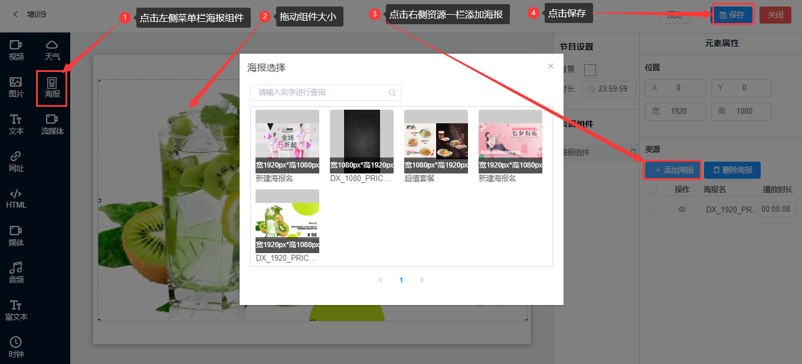

## 海报组件
* 海报组件是用于展示海报页的框体控件。本质上是海报功能的组件化。
* 点击左侧菜单栏的海报组件，拖动海报组件大小，点击右侧资源一栏里的添加海报，输入海报名字，点击保存。

* 资源
1. 添加海报：海报组件是提前在海报模板或自定义中模板做好并保存的，使用时直接添加即可。

2. 删除海报：选中海报资源，点击删除海报。

3. 在海报组件中是不能修改海报内容的。

4. 播放时长：默认是动效海报本身的时长，也可以自己设置海报的播放时长。
