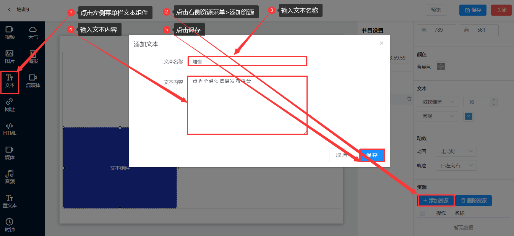

## 文本组件
* 文本组件是用于滚动显示文字内容的框体控件，可设置最少一个文本信息。
* 点击左侧菜单栏文本组件，在右侧资源菜单下添加资源，可以输入文本名称和文本内容>点击保存。

* 背景颜色

1. 背景色：默认是灰色背景，也可点开颜色背景板自行选择。

* 文本设置

1. 字体：微软雅黑、宋体、黑体

2. 大小：自行选择

3. 格式：默认常规、有加粗、斜体、加粗和斜体

4. 颜色：自行选择

* 动效设置

1. 动画：默认是走马灯，还有一种翻页滚动。

2.  轨迹：默认是自左向右，还有一种是自右向左。

3.  间隔/速度：在翻页滚动里，有间隔和速度的设置。

* 资源上传

1. 添加资源：需要输入文本名称和文本内容，点击保存即可

2.  删除资源：选中文字，点击删除资源

3.  修改文字：点击操作下面的图标即可修改文字。
