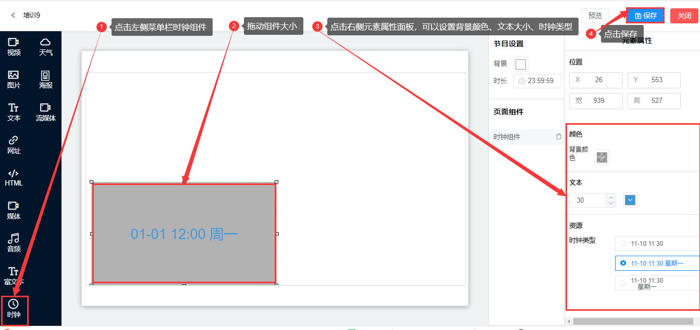

## 天气组件
* 天气组件是用于展示屏幕设备天气的框体控件。
* 点击左侧菜单的天气组件，可以拖动组件大小，在右侧资源菜单下可以填写所在城市名称，点击保存。

* 文字

1.  文字颜色：可以自己选择字体的颜色。

* 资源

1. 城市名称：如果通过网络定位的城市有问题，建议此处输入显示天气预报的城市名称。城市名称如：上海市、北京市等。

2. 自行选择天气组件的显示方式。

3. 组件展示的是屏幕设备网段地址城市的天气。

4. 在节目的播放中，天气组件会每小时进行一次联网更新，如果更新时未找到网络，组件会保持上一次的天气。
