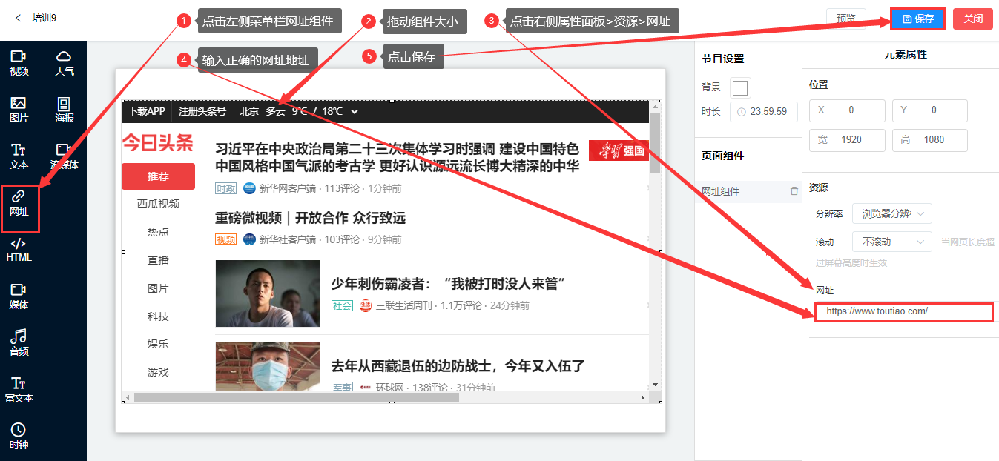

## 网址组件

* 网址组件是用于内嵌其他网页内容的框体控件。
* 点击左侧菜单栏的网址组件，拖动组件大小，找到右侧元素属性面板>播放地址>网址，输入正确的网址地址>点击保存。

#### 播放配置

* 分辨率
1. 默认使用浏览器分辨率。
1. 安卓系统浏览器的分辨率会比真机分辨率小。如：1920*1080的真机分辨率，浏览器分辨率只有1024*768的大小。对于未做自适应的网页显示，需要选择合适的分辨率。
1. 一般来讲，电脑端的网页使用真机分辨率，移动端的网页使用浏览器分辨率，效果会更佳。

* 滚动
1. 当网页长度超过屏幕高度时生效。
1. 默认不滚动
1. 滚动配置项里提供：快、中、慢三种滚动速度

* 白名单
1. 填写了根域名白名单，会禁止跳转白名单以外域名，不填写不处理。
1. 主要是防止跳转一些非法域名，如广告、色情网站等。

#### 播放地址

在线的网页地址

