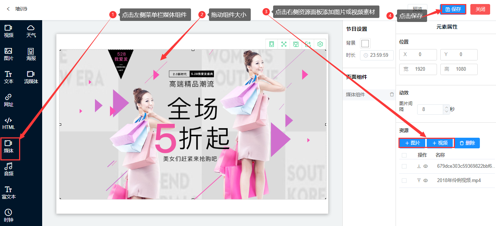

## 媒体组件
#### 媒体组件是用于播放图片和视频的组合框体控件。

（1）点击左侧菜单栏的媒体组件，拖动组件大小，在右侧资源面板中添加图片或视频素材，点击保存。

###### 功能说明：  

a、右侧元素属性面板中，在动效里，可以设置图片和视频之间的间隔。

b、在资源菜单下，可以添加或删除图片、视频资源，在操作栏中可以设置播放顺序。

c、媒体组件中的素材资源在画布面板中是重叠显示的，只能看见一个素材。
 
