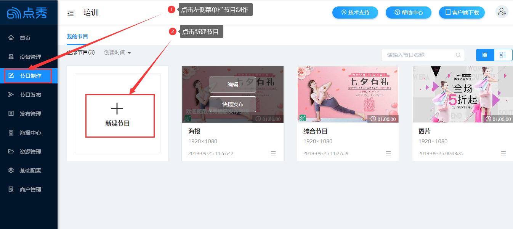
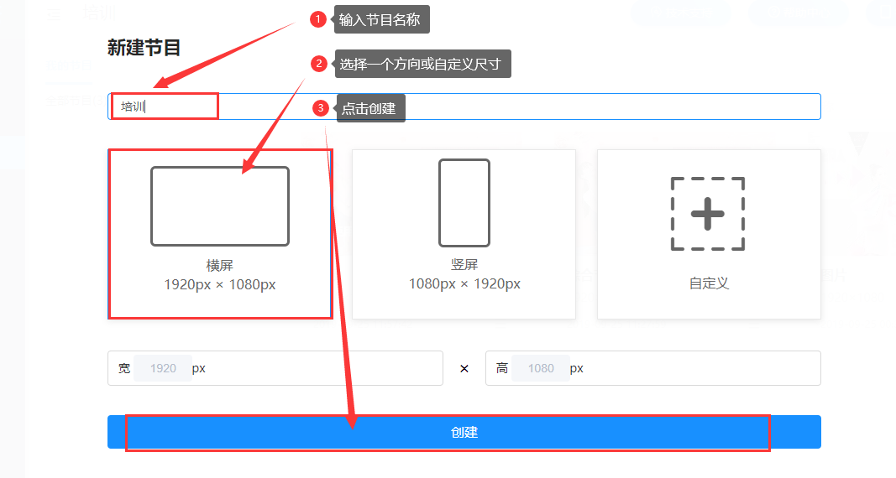
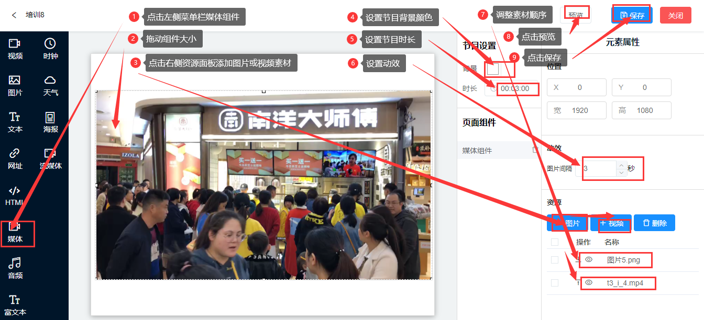

## 节目制作
### 新建节目
（下面以媒体组件给大家举例，其他组件在下一个节目组件模块一一给大家介绍。）

（1）进入后台。点击左侧菜单栏节目制作>我的节目>新建节目。

（2）新建节目。弹出一个新的页面（新建节目），输入节目名称>选择横屏/竖屏/或自定义（并输入尺寸大小）>点击创建，进入节目编排页面。

  

（3）制作节目。（以媒体组件为例）点击左侧菜单栏的媒体组件>拖动组件大小>在右侧资源面板中添加图片或视频素材>设置节目背景和时长>设置动效>调整多个素材的播放顺序>点击预览>点击保存。

  
