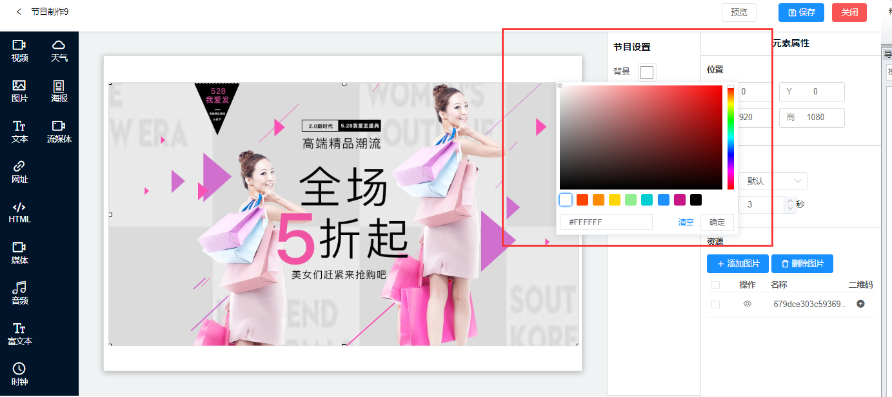
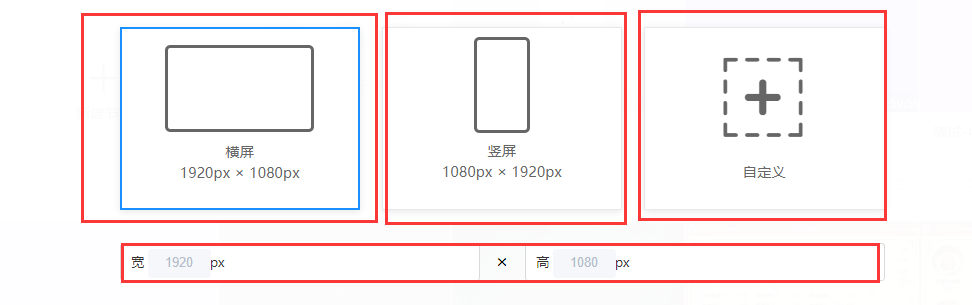

## 更多功能

## 节目背景
在节目属性面板下，可以设置节目的背景颜色。

## 节目时长
（默认时长是24个小时）根据节目需要或本身的时间设置相应的时长。

## 节目尺寸
横屏节目：1920 * 1080  
竖屏节目：1080 * 1920                                  
自定义：根据个人需求可以设置节目的任意大小，但是节目尺寸大小与设备分辨率不等比是无法全屏播放的。

## 组件位置 （X,Y,宽，高）的解释
X:调整组件在画布中的横向位置                            
Y:调整组件在画布中的纵向位置                               
宽：调整素材的宽度       
高：调整素材的高度                              
（注：可以手动调整组件的位置和素材的大小，也可以在元素属性面板输入相应的数值）
