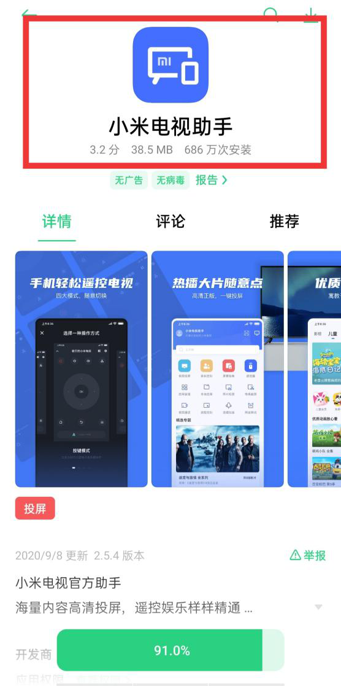
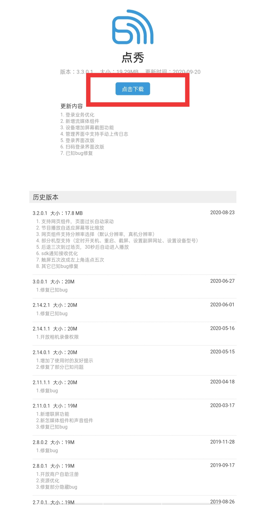
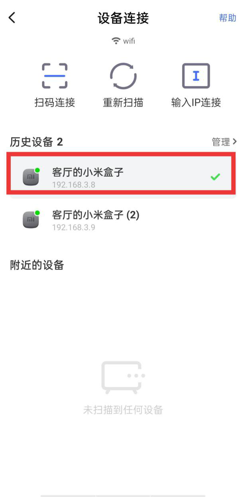
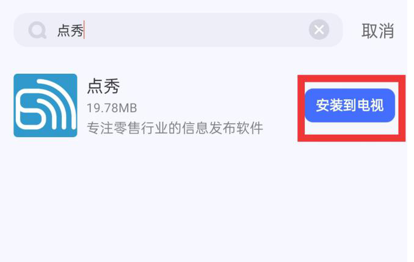
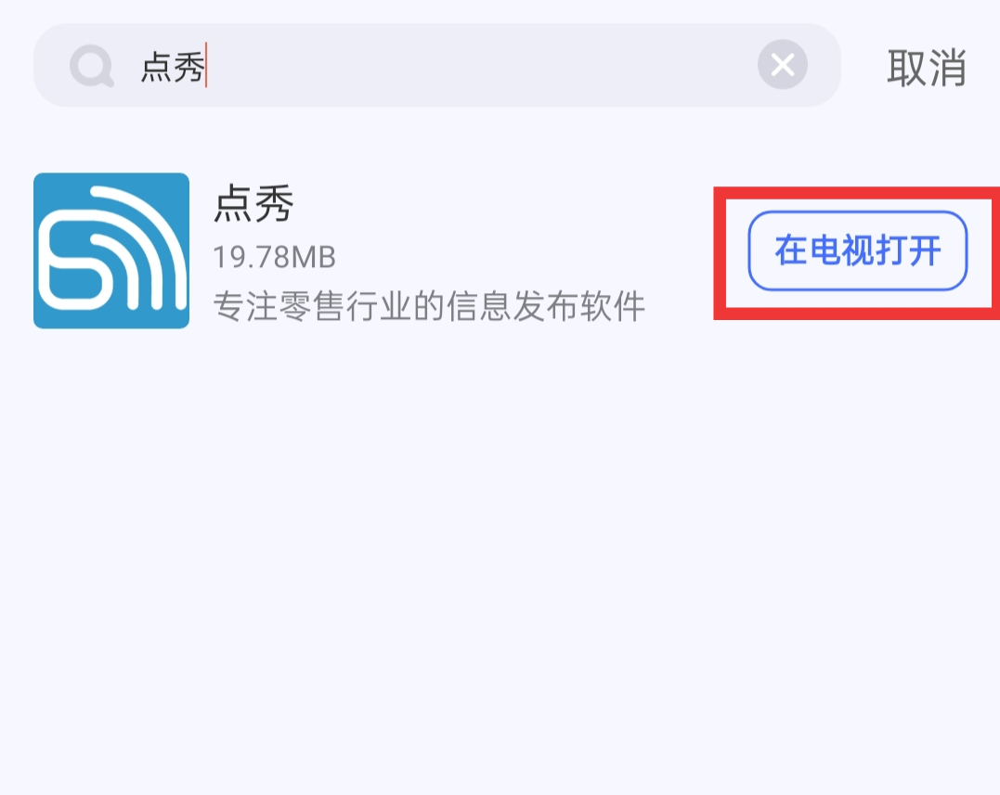

### 小米电视助手安装点秀APP
1、首先在手机应用商店下载小米电视助手和官网上下载我们的点秀APP;

2、确保小米电视/盒子与手机在同一网络下；  

3、手机打开小米电视助手，搜索并添加您的小米电视/盒子；

4、连接成功，进入小米电视助手首页，点击应用管理，选择上方管理，点击本地应用安装或者直接搜索安装包名称（如点秀)；

5、进入本地安装的页面，找到需要安装的安装包，点击相应的安装包-安装到电视；

6、小米电视上提示需要输入验证码时，需要在手机上输入电视上显示的验证码，点击继续安装（小米电视盒子连接的直接安装）；

7、等待手机端的本地安装包下载完成，右侧按键状态变为在电视上打开，点击在电视上打开，即可在电视上启动本地应用。

