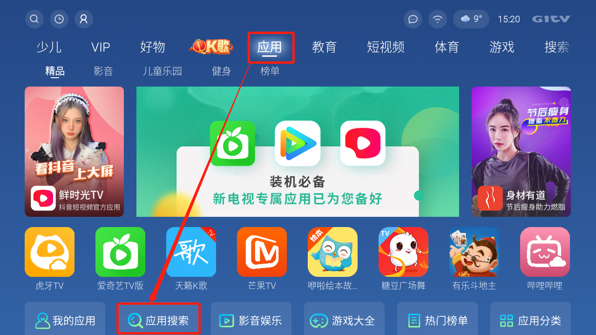
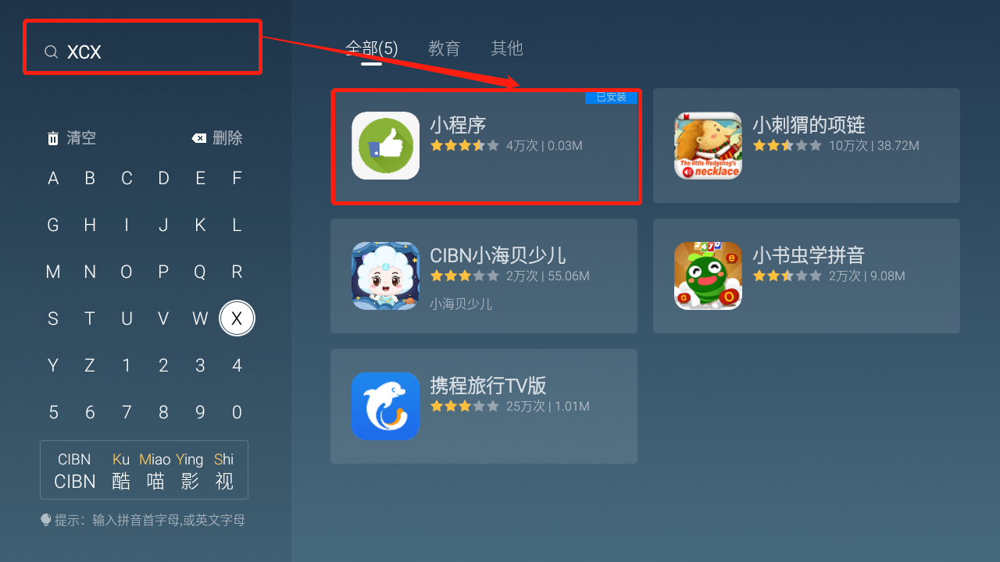
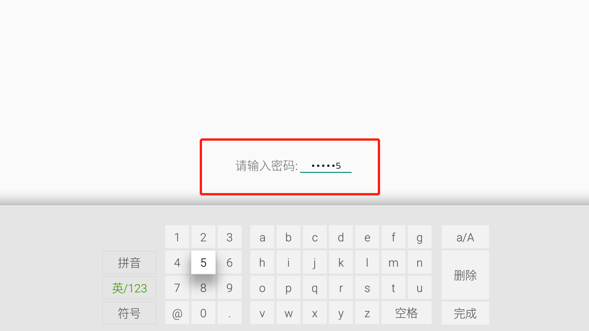

##### 创维电视没有切换成U盘模式的选项，也能轻松安装第三方应用了！

###### 具体步骤如下：

[1、	在电脑上下载好APK并复制到U盘；](https://s.pointshow.net/s/p/down/down.html)

2、	首先打开创维电视机的首页，点击应用菜单，进入应用搜索；

3、	将U盘插入创维电视机的USB接口上，然后在【搜索】功能界面输入“XCX”，找到【小程序】应用并打开；

4、	打开【小程序】应用，需要输入密码“55559510”，密码输入正确后点击确认键，再点U盘安装，就可以自动识别U盘内的所有应用，打开点秀APK并确认安装即可。

