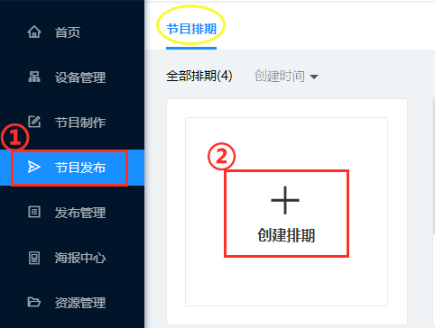
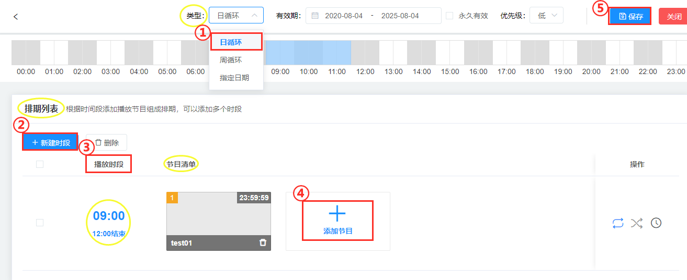
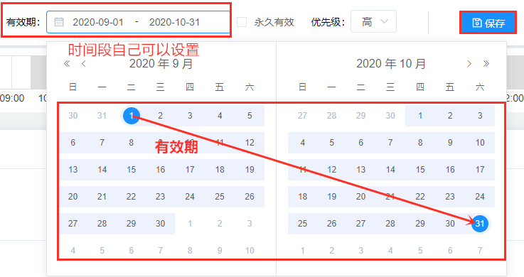
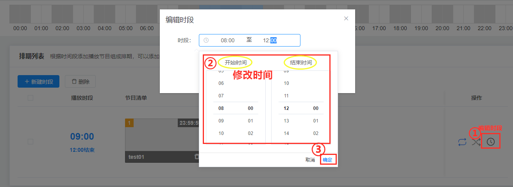

# 排期使用指南
排期：通过时间计划对屏幕的播放进行管理。有多种时间管理方式，可精确到天：日排期、周排期、指定日期。可精确到时、分、档期。做好时间计划后，添加需要播放的节目。只有经过排期的节目才可以发布到屏幕。
## 创建排期
①（导航栏）节目发布

②（节目排期）创建排期                 
注：每个节目排期必须包含至少一个节目。

## 排期周期设置
### 日排期
按日进行循环播放的排期

①（类型）日循环                                                
②（排期列表）新建时段     
③选择播放时间段（注：默认是24小时）   
④添加节目     
⑤保存          

### 周排期
按周进行循环播放的排期，可指定周一到周日的播放内容。

①（类型）周循环   
②选择周一到周日中的任一一天(注：多天也可以)     
③新建时段     
④选择播放时间段      
⑤添加节目   
⑥保存   
（注：根据时间段添加播放节目组成排期，可以添加多个时段）          

### 指定日期
指定将来某1-N天的排期。如设置国庆档、春节档。                  
（注：除去今天以前，包括今天）

①（类型）指定日期              
②（有效期）选择将来指定一天（注:包括今天，今天之前是不能播放的）
③新建时段       
④选择播放时段       
⑤添加节目—节目列表—选中节目—确定    
⑥保存

## 排期功能

### 排期优先级
当两个排期在同一个时间发布在同一屏幕时, 系统会先以排期类型确定优先级（规则如下）。

1、系统会先以排期类型确定优先级，按照指定日期，播放类型等级最高的排期节目；   
2、在排期类型相同时，以排期设定的优先级高>中>低，播放优先级最高的排期节目；   
3、当优先级相同时，以后发布>前发布，播放发布时间最新的排期节目。

### 排期有效时间
从设置的那天到结束的某一天都是有效播放的                
（注：日循环和周循环是一样的，指定日期只有一天哦，记得保存~）。

### 永久性有效排期
系统默认的是1900-1-1至2050-设置那天日期，有的机器会丢失时间，导致节目不能播放，所以设置一个长时间。

### 多天复制
首先需要新建一个时段和节目添加好之后，会复制当前选中天的时段及时段中的节目到所天。

①新建时段—添加节目—节目列表—选中节目—确定   
②多天复制  
③复制到所选天  
④确认复制      
⑤保存

注意事项：
1. 所复制的天要设置时段，并添加节目。
2. 会自动清空复制到所选天已存在的时段及时段中的节目。
3. 会复制当前选中天的时段及时段中的节目到所选天。
  
## 时段
### 建立时段
①新建时段   
②编辑时段（选择开始和结束时间）      
③确定

### 修改时段
①编辑时段     
②修改时间      
③确定

### 添加节目

①添加节目   
②选中节目    
③确定

### 节目顺序播放
指定时间段内，多个节目，按顺序播放，播放顺序可以任意拖动节目进行调整。

### 随机播放
指定时间段内，多个节目，不按一定的顺序播放，是系统随机播放。

### 周期性播放
在选中的时间段内，多个节目按照你设置的单次播放时间和间隔时间，呈现周期性播放。

①（操作）编辑时段         
②（高级设置）使用周期性播放           
③单次播放时间（注：一个节目的时间）   
④间隔时间（注：每个节目之间间隔的时间）   
⑤确定     
⑥保存

