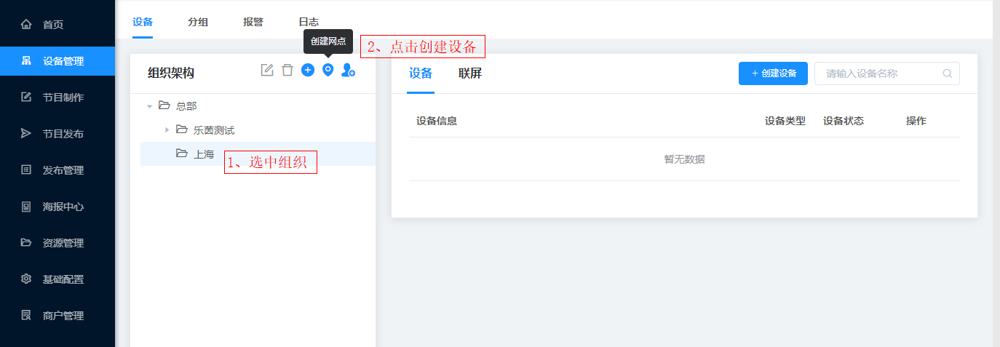
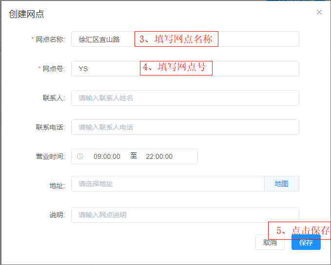
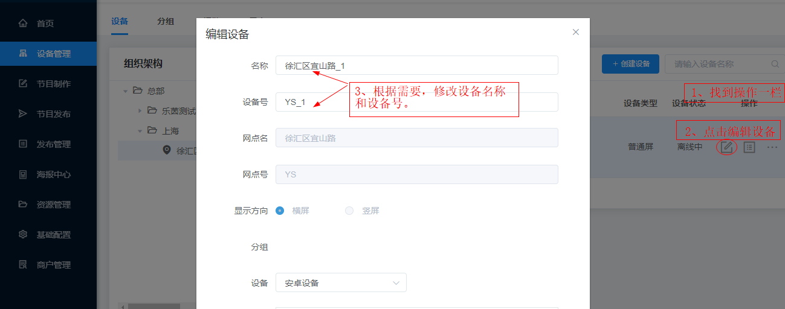

# 设备管理使用指南
## 设备管理
设备管理为平台核心功能之一，支持多级组织架构管理以及分组管理，组织间各自管理自己的节目内容及发布管理。终端组织为门店或位置，设备设置在终端组织上，一个组织支持多个设备。
## 组织管理
### 创建组织
点击左侧菜单栏里的设备管理，找到设备一栏，选中组织架构里的总部，创建一个子组织>创建组织>输入组织名称>保存。

### 创建网点
选中上一步里创建的组织，点击创建网点，弹出一个对话框>创建网点，填写合适的网点名称和网点号，其他信息可以不填，最后点击保存。

## 设备管理
设备：指所有可用于联网登录浏览器编排节目的设备。
### 创建设备
选中上一步里创建的网点，点击创建设备，弹出一个对话框>创建设备，填写设备名称和设备号，根据需要选择设备的显示方向横屏或竖屏，最后点击保存。

### 激活设备
在需要发布的设备上，打开点秀APP，输入登录密码，重新刷新页面，设备被激活，设备状态显示已启用。

### 设备状态
①未激活：还未输入登录密码，设备未被激活状态   
②在线：在设备上输入登录密码，成功登录显示的状态     
③离线：设备登录过，之后退出登录，并退出APP显示的状态

### 编辑设备
找到操作一栏，点击编辑设备，根据需要可以修改之前创建过设备的名称、设备号等信息并保存。

### 设备详情
找到操作一栏，可以查看设备的基本信息，包括系统信息和APP版本，右侧有个更新按钮，成功激活设备后，可以获取设备信息。

### 查看排期
找到操作一栏，点击查看排期。

### 设备旋转
找到操作一栏，点击设备旋转，弹出对话框>设备旋转>设备角度，根据需要选择一个合适的旋转角度。    
注：基于屏幕默认位置(设备底部在下面)做为零度，可操作：左转90度，右转90度。最后的操作结果有4种角度(逆时针)：0，90，180，270。

### 禁用设备
找到操作一栏，并找到需要禁用的设备，点击禁用设备即可，一旦禁用设备将停止播放节目。

### 删除设备
找到操作一栏，并找到需要删除的设备，先点击禁用设备，再点击删除设备即可。
## 联屏管理
联屏：当可播放设备均处于同一个局域网内，可使用联屏功能。
（注：详细联屏使用指南见）https://help.pointshow.cn/#/start/wall
## 分组管理
分组：分组页面包含对分组的控制，包括添加、删除、重命名分组等功能。
## 报警/日志
报警：报警页面包含对屏幕异常状态的提醒。    
日志：日志页面包含对屏幕信息的日常记录。
