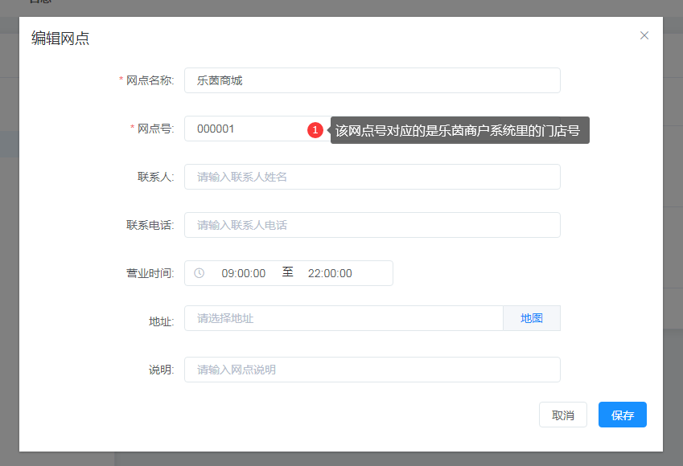

# 第三方应用


## 在线应用

### 使用方法
1. 新建节目，选择网址组件。
2. 网址组件的网址填入在线应用地址。


### 乐茵商城

1. 创建网点

网点号的内容必须填写乐茵商城系统中对应的门店号。（门店号咨询乐茵商家获取。）



2. 在上面创建的网点下创建屏幕

3. 创建节目

* 节目中使用网址组件
* 地址填写 https://s.pointshow.net/mkt/a/kzMall/index.html?fFuncId=聚合分类
* 地址中的聚合分类必须有，咨询乐茵商家获取。
* 地址中其他参数，参考下面[应用地址附带更多参数说明]

4. 发布节目到上面创建的网点下任意屏幕即可。

#### 应用地址附带更多参数说明

|应用参数|名称|值|必须|说明|
|--|--|--|--|--|
|聚合分类|fFuncId||Y|咨询乐茵商家获取|
|商品分类|fGoodsCategroyId||N|咨询乐茵商家获取|
|商户id|merchantId|LSLYYSH|N|固定值|
|来源|resource|LSLYYSH|N|固定值|
|秘钥|secretKey|1L+ajdQqZGWZPFeCnMsSjjc1hmidckLU|N|固定值|
|接口地址|api|参考下面的值，或者咨询客服获取|N|必须使用encodeURIComponent编码后使用|
|页面轮播速度|speed||N|默认1秒|
|页面轮播间隔|time|LSLYYSH|N|默认4秒|

接口地址：http://49.4.27.85:8092/kzPlatformOut/mallGoodsShelfCtrl/queryMallGoodsShelfListByShopCode

```
// 应用地址附带参数使用示例
// 参数除了fFuncId必须使用，其他可以随意选取使用，不使用也可以。
// url参数使用可以参考：https://www.jianshu.com/p/6562e0b0e016
https://s.pointshow.net/mkt/a/kzMall/index.html?fFuncId=聚合分类&api=api地址&time=8&speed=1

```


