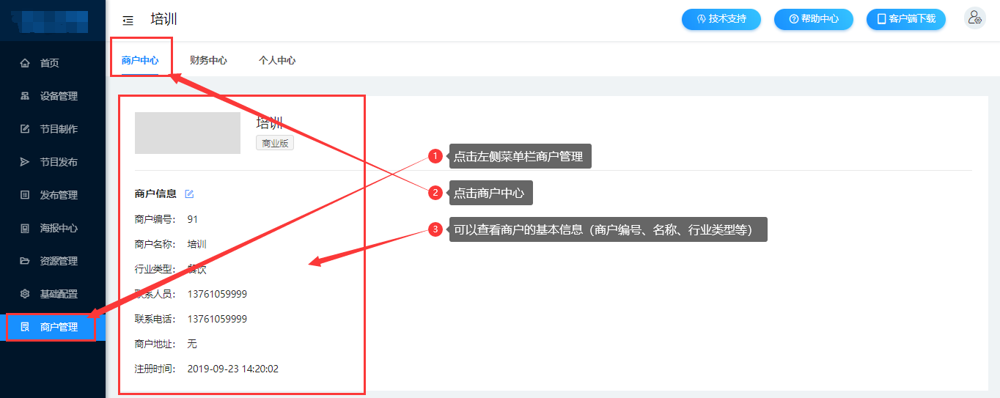
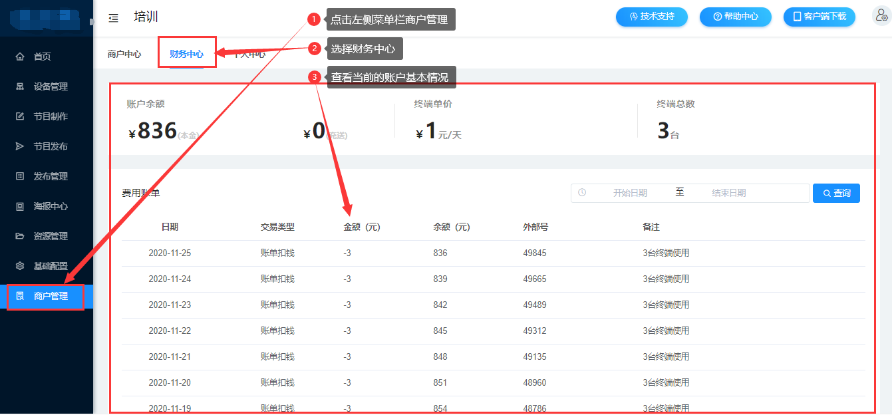
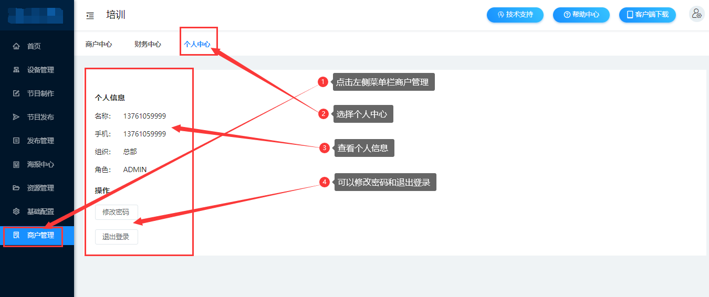

### 商户管理

在商户管理菜单下可以查看商户的基本信息，每天的使用终端数及扣款，也可以修改登录密码等信息。

#### 商户中心

点击左侧菜单栏商户管理，选择商户中心，可以查看商户的基本信息，包括商户编号、名称、行业类型、联系人、电话、地址和注册时间等。

#### 财务中心

点击左侧菜单栏商户管理，选择财务中心，可以查看当前的账号余额，终端单价、总数以及每天的扣款情况。

#### 个人中心

点击左侧菜单栏商户管理，选择个人中心，可以查看当前的个人信息，名称、手机、组织、角色、修改密码和退出登录。

