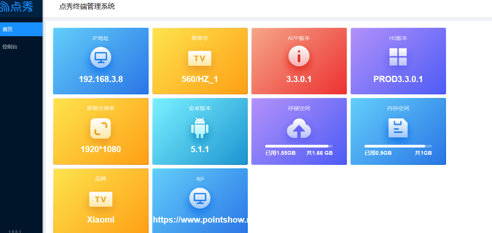

## 点秀终端管理系统（在同一个局域网内）

访问ip+8080端口即可进入点秀终端管理系统

例如：192.168.3.8：8080

注：ip地址可以通过遥控器连续按五次确认键退出查看

### 首页

（1）点击左侧菜单栏进入首页界面，里面可以看到设备的基本信息

### 控制台

（1）点击左侧菜单栏进入控制台界面，在这里可以对文件、点秀APP、设备进行操作和控制。

（2）在信息查看一栏，可以对设备进行截屏、查看APP在前台以及节目播放的内容。

