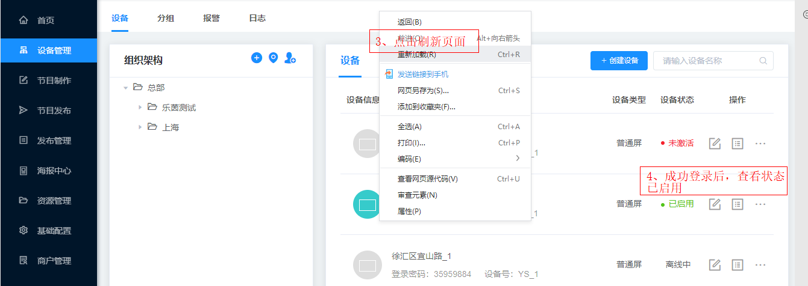
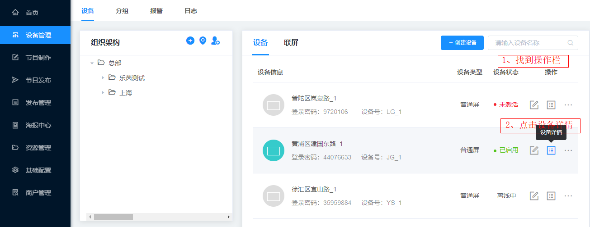

设备：指所有可用于联网登录浏览器编排节目的设备。
### 创建设备
选中上一步里创建的网点，点击创建设备，弹出一个对话框>创建设备，填写设备名称和设备号，根据需要选择设备的显示方向横屏或竖屏，最后点击保存。

### 激活设备
在需要发布的设备上，打开点秀APP，输入登录密码，重新刷新页面，设备被激活，设备状态显示已启用。

### 设备状态
①未激活：还未输入登录密码，设备未被激活状态   
②在线：在设备上输入登录密码，成功登录显示的状态     
③离线：设备登录过，之后退出登录，并退出APP显示的状态

### 编辑设备
找到操作一栏，点击编辑设备，根据需要可以修改之前创建过设备的名称、设备号等信息并保存。

### 设备详情
找到操作一栏，可以查看设备的基本信息，包括系统信息和APP版本，右侧有个更新按钮，成功激活设备后，可以获取设备信息。

