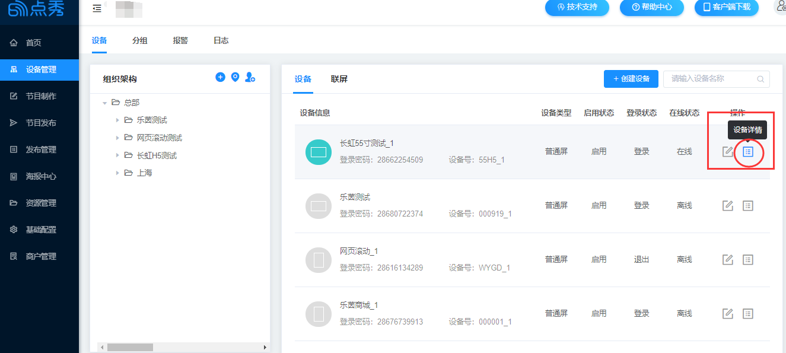
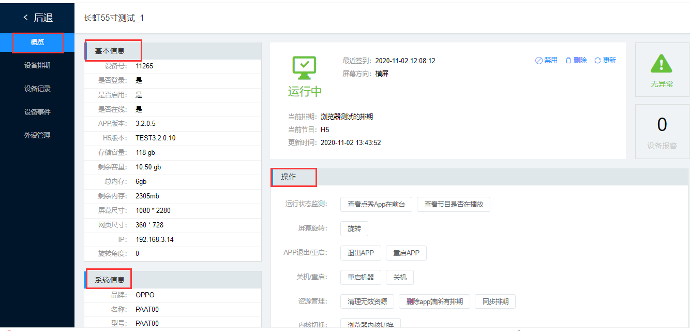
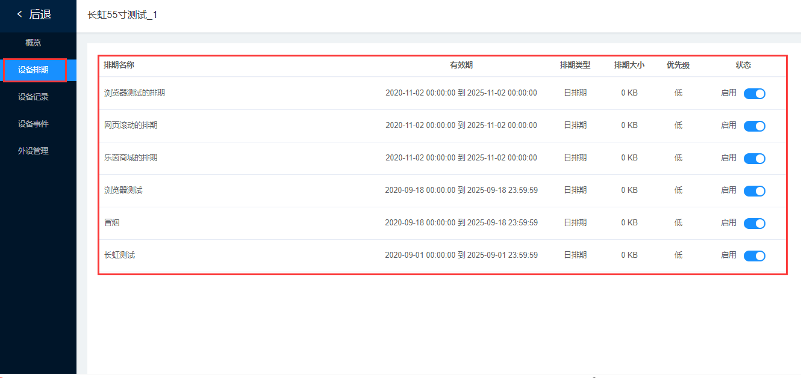
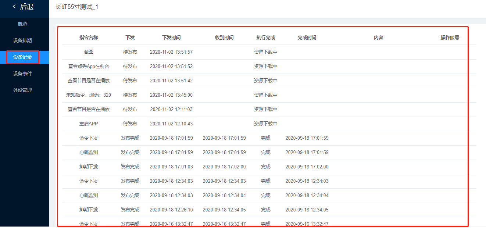

### 商户平台-设备的详细与管理

在3.4.0.1版本中，商户平台可以更方便的看到设备的详细信息和管理，有利于技术人员更快定位终端问题，更好解决客户问题。

1、进入商户平台页面，点击设备详情。

2、在设备详情页面，概览菜单下，可以看到设备的基本信息、系统信息、和对APP的基本操作。

3、设备排期菜单下，可以查看所有排期的名称、有效期、排期类型、排期大小、优先级和状态。

4、设备记录菜单下，可以查看设备的每一步操作。

