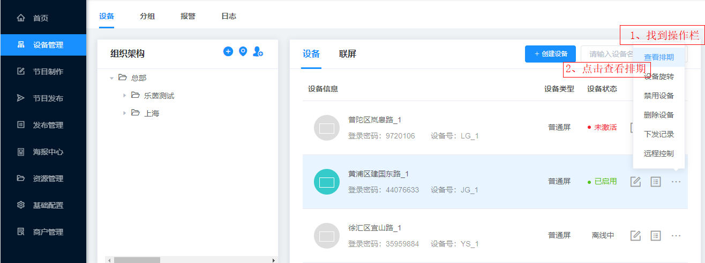
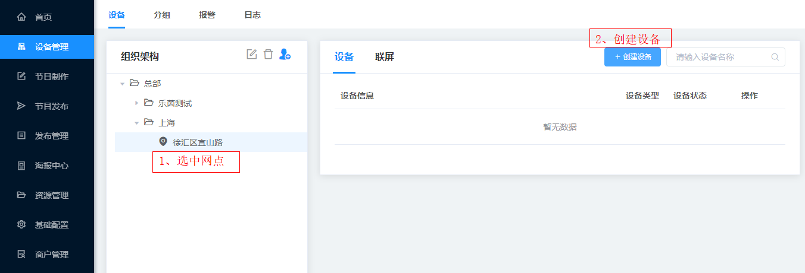

### 查看排期
找到操作一栏，点击查看排期。

### 设备旋转
找到操作一栏，点击设备旋转，弹出对话框>设备旋转>设备角度，根据需要选择一个合适的旋转角度。    
注：基于屏幕默认位置(设备底部在下面)做为零度，可操作：左转90度，右转90度。最后的操作结果有4种角度(逆时针)：0，90，180，270。

### 禁用设备
找到操作一栏，并找到需要禁用的设备，点击禁用设备即可，一旦禁用设备将停止播放节目。

### 删除设备
找到操作一栏，并找到需要删除的设备，先点击禁用设备，再点击删除设备即可。

### 截图
todo

### 重启
todo
