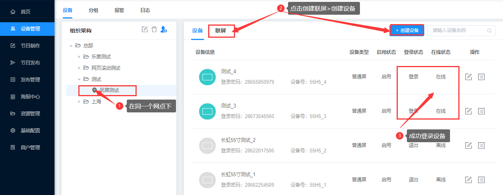
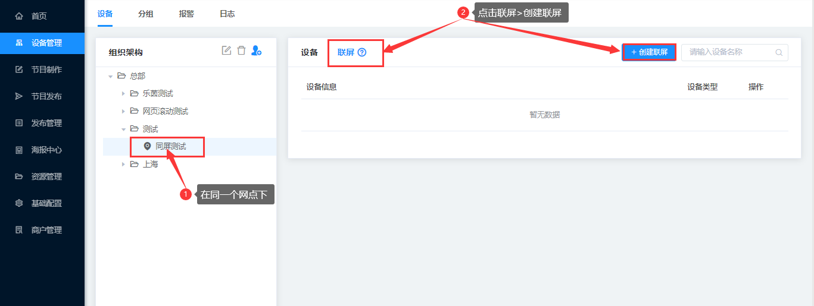
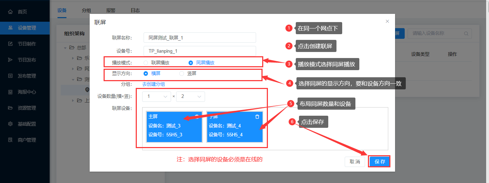
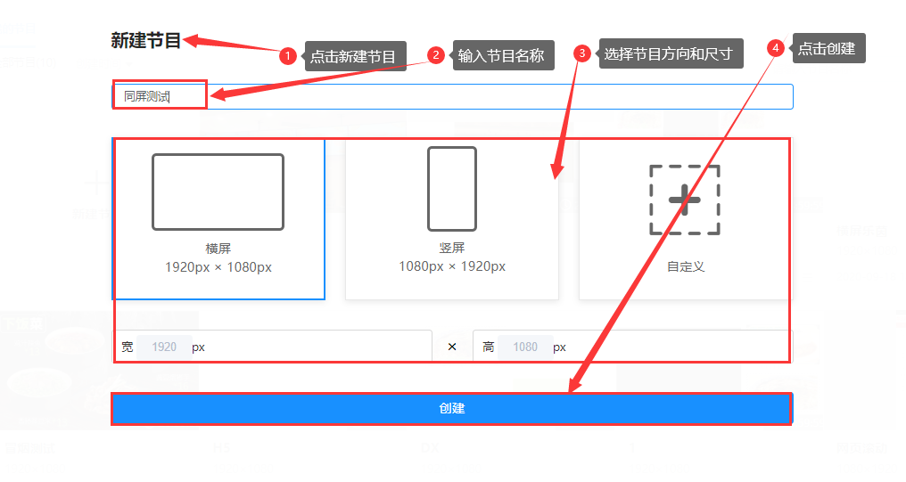
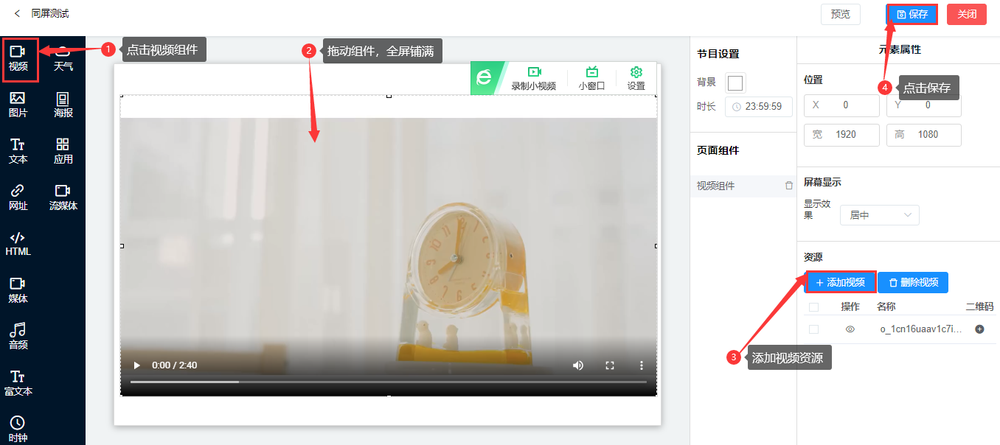
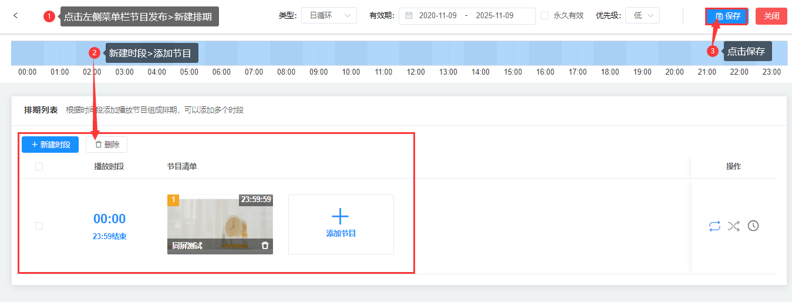
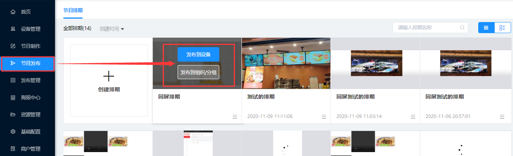
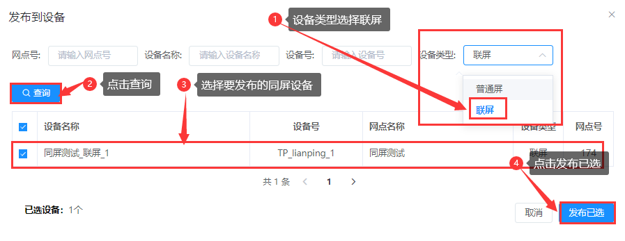

### 同屏播放使用指南

#### 创建设备

在同一个网点下，创建多个设备，并成功登录设备。设备的方向、尺寸要保持一致。

#### 创建联屏（播放模式选择同屏播放）

在同一个网点下，点击联屏>创建联屏，输入联屏名称和设备号，在播放模式选择同屏播放，进行同屏布局，点击添加节目并成功登录，最后点击保存。

#### 制作同屏节目

注：同屏只支持节目内只有一个视频组件，且视频组件中只有一个视频。

#### 新建节目

点击左侧菜单节目菜单>点击新建节目，选择节目方向和尺寸大小。

#### 添加视频

点击左侧视频组件，然后全屏铺满，添加视频资源，进行保存。同屏功能只支持视频组件。

#### 创建同屏排期

点击左侧菜单栏节目发布，点击新建排期，添加同屏节目，点击保存。

#### 发布同屏节目

鼠标移到要发布的节目排期上，点击发布设备/组织。弹出框中，设备类型勾选联屏，进行查询。选择要发布的同屏，点击发布已选。发布后，根据视频大小，系统会处理一段时间。

