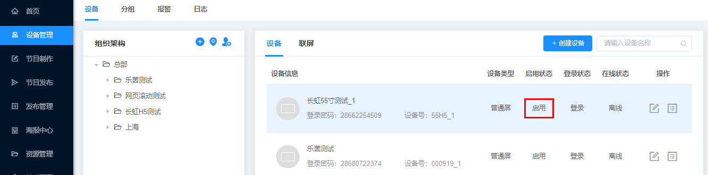
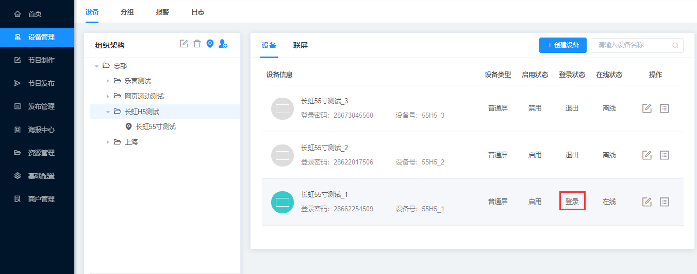
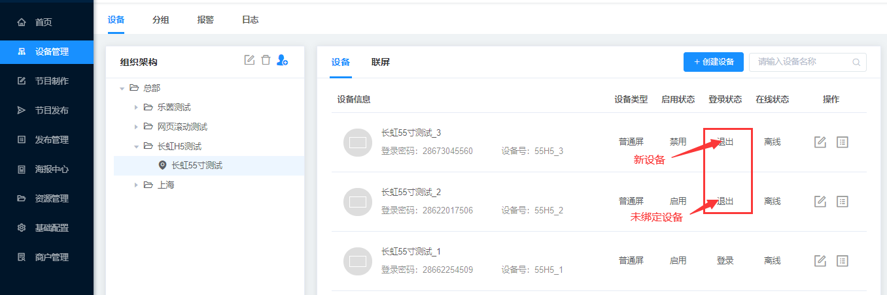
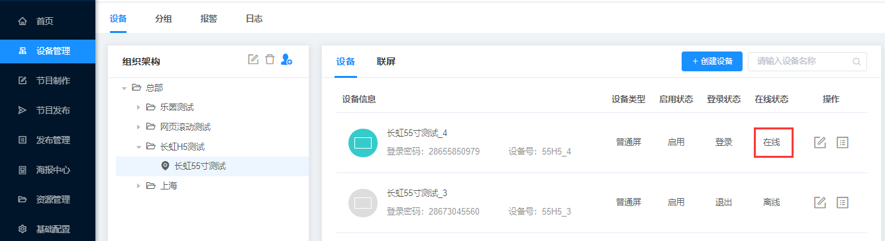
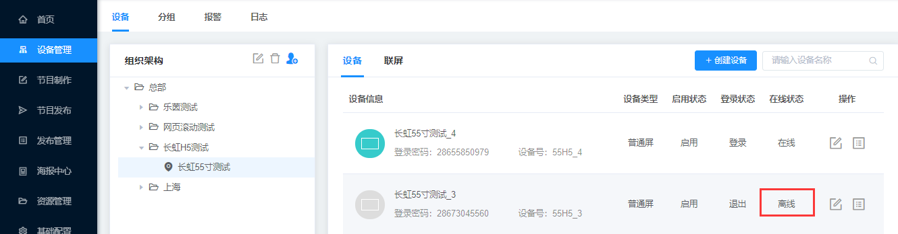

### 设备状态

#### 启用状态

启用：设备被激活之后（启用后的设备开始收费）

禁用：新建的设备开始都是禁用状态，被激活之后显示启用状态。

#### 登陆状态

登录：设备输入登录密码，成功绑定设备，登录一栏显示登录状态。

退出：新建的设备开始都是退出状态，或者未绑定任何设备。

#### 在线状态

在线：设备输入登录密码，点击右击刷新，在线状态显示在线。

离线：新建设备、设备退出APP、设备断网在线状态都显示离线。

